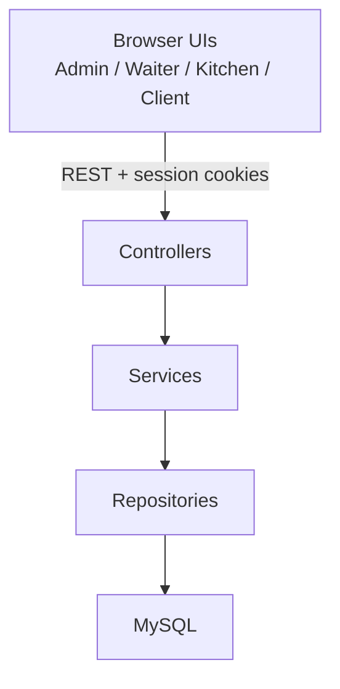
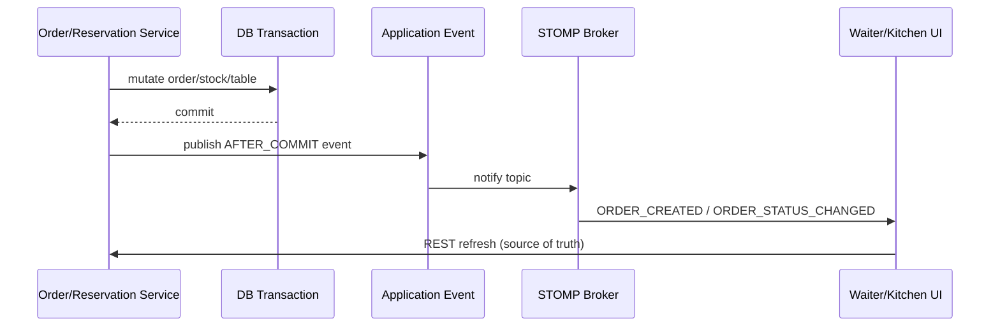

# Architecture

Restaurant POS and Reservations is a **modular monolith**: one Spring Boot deployable, clear package boundaries, one MySQL database.

## High-level flow

## Module layout

| Package | Responsibility |
|---|---|
| `common` | Shared exceptions, API errors, restaurant `Clock` |
| `security` | Session auth, CSRF, role redirects, CSRF token API |
| `user` | Users, roles, BCrypt passwords |
| `menu` | Categories, items, effective availability |
| `inventory` | Ingredients, stock, recipes |
| `diningtable` | Floor tables and status |
| `order` | Orders, order items, stock deduction, workflow |
| `kitchen` | Kitchen queue API + STOMP security/topics |
| `reservation` | Availability, booking, conflict checks |
| `payment` | Simulated CASH/CARD payment + receipt |
| `report` | Operational sales aggregates |
| `demo` | Optional `@Profile("demo")` seed data |

Controllers stay thin. Business rules live in services. Repositories access JPA entities only.

## Source of truth

- **REST + MySQL** are authoritative for business state.
- WebSocket/STOMP messages are **notifications only**.
- UIs reload state via REST after notifications (debounced).

## WebSocket notification flow

## Concurrency and consistency

- Reservation overlaps use conflict checks and pessimistic locking where required.
- Payments use locking so an order can have at most one payment.
- Ingredients and dining tables use `@Version` optimistic locking.
- Money amounts use `BigDecimal` / MySQL `DECIMAL`.
- Reservation “now” uses an injectable `Clock` in the restaurant time zone.

## Security model

- Session-based form login (no JWT).
- CSRF enabled for browser mutating HTTP and STOMP `CONNECT`.
- Role routes: `/admin/**`, `/waiter/**`, `/kitchen/**`, `/client/**`, `/operations/**`.
- API prefixes mirror roles (`/api/admin/**`, `/api/waiter/**`, …).
- Password hashes never appear in API responses.

## What this architecture intentionally avoids

No microservices split, no external broker, no outbox/event store, no real payment gateway, no Docker packaging in this repository scope.