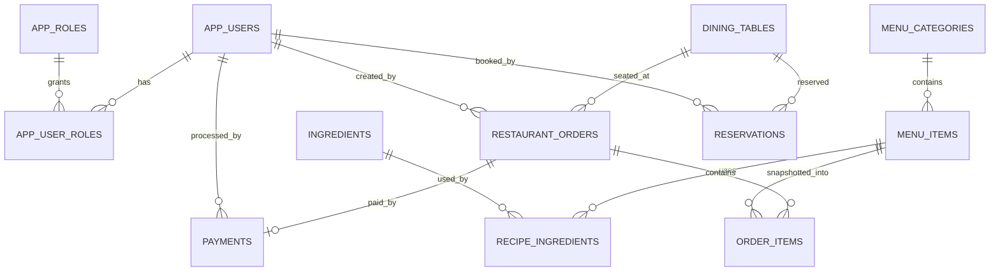

# Database

Persistence is **MySQL 8+** via Spring Data JPA. Schema is maintained with `spring.jpa.hibernate.ddl-auto=update` (no Flyway/Liquibase in this project).

## Entity relationship overview

## Core tables

| Table | Notes |
|---|---|
| `app_users` / `app_roles` / `app_user_roles` | BCrypt password hash; many-to-many roles |
| `menu_categories` / `menu_items` | Unique names; `manual_available` + effective `available` |
| `ingredients` | Stock + minimum; `@Version` |
| `recipe_ingredients` | Unique `(menu_item_id, ingredient_id)` |
| `dining_tables` | Unique `table_number`; status + `@Version` |
| `restaurant_orders` / `order_items` | Snapshot name/price on items; workflow status |
| `payments` | One payment per order; unique receipt number |
| `reservations` | Unique reservation number; interval + status |

## Important constraints

- One payment per order (`existsByOrderId` / unique order association).
- Unique receipt numbers for simulated receipts.
- Unique reservation numbers.
- Optimistic `@Version` on ingredients, tables, reservations, payments where applicable.
- Order item prices/names are snapshots (menu changes do not rewrite history).
- Money columns use `DECIMAL` precision (not floating point).

## Intentionally absent tables

There are no tables for:

- `websocket_messages` persistence
- report snapshot warehouses
- real gateway transactions / refunds / invoices
- `card_number`, `cvv`, `iban`, `payment_token`

## Credentials

Database passwords are supplied only via environment variables (`DB_PASSWORD`). Never commit real credentials.